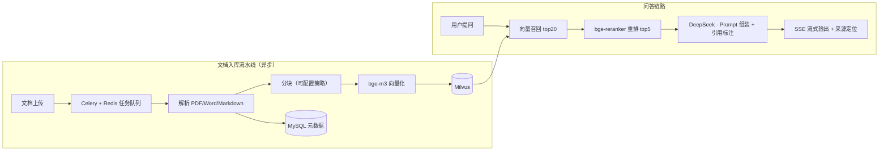

# KB-Copilot 企业级知识库问答平台

> 基于 FastAPI + 自研 RAG 链路的企业知识库问答平台：文档异步入库、两阶段检索（向量召回 + 重排序）、SSE 流式问答、引用溯源、Ragas 自动化评测闭环。

**🌐 在线 Demo**：http://xiaoloong.miyaki.top:3389 （访问口令见简历/联系作者；语料为贵州茅台 2020–2025 年报）

## 架构



*（架构图将随开发进度细化）*

## 技术栈

| 层 | 选型 |
|---|---|
| API | Python 3.11 · FastAPI · SSE 流式 |
| LLM | DeepSeek API（Qwen 对比） |
| Embedding / Rerank | bge-m3 · bge-reranker-v2-m3 |
| 向量库 | Milvus |
| 元数据 | MySQL 8 |
| 异步任务 | Celery + Redis（任务状态机：pending → parsing → embedding → done/failed） |
| 评测 | Ragas + 自建评测集（100+ QA） |
| 部署 | Docker Compose |

## Roadmap

- [x] M1：FastAPI 骨架 + SSE 流式多轮对话（会话管理、上下文裁剪）
- [x] M2：文档异步入库流水线（解析 → 分块 → 向量化，任务可查询/重试/取消）
- [x] M3：两阶段检索 + 引用溯源（文件名 + 页码定位）+ 无答案兜底
- [x] M4：Ragas 评测闭环（分块策略 / rerank / top_k 三组对照实验）
- [ ] M5：Docker Compose 一键部署 + 线上 Demo + CI

## 评测报告

评测集：100 条 QA（11 份贵州茅台年报/半年报语料，85% 数字/表格类事实题，人工抽查修正）；Ragas 四指标 + 三组对照实验（[完整报告](docs/eval-report.md)）。

| 配置 | faithfulness | answer_relevancy | context_recall | context_precision | P95 |
|---|---|---|---|---|---|
| 纯向量 top5 | 0.30 | 0.29 | 0.26 | 0.19 | 1.66s |
| **+ rerank top5（默认）** | 0.35 | 0.34 | **0.36** | 0.27 | 1.91s |
| + rerank top10 | 0.39 | 0.42 | 0.33 | 0.24 | 2.00s |

三组实验核心结论：

1. **rerank 全面有效**：context_recall +38%（0.26→0.36）、context_precision +42%（0.19→0.27），代价仅 P95 +0.25s
2. **top_k 是召回/精度/成本三方 trade-off**：top5 召回最高，定为默认
3. **structured 分块反直觉地弱于 fixed**（recall 0.29 vs 0.36）——评测集由 fixed 分块反向生成存在亲和性偏差，已在报告中如实记录（做实验 ≠ 只报好消息）

## 快速开始

```bash
git clone https://github.com/fangnimadepi/kb-copilot.git && cd kb-copilot
cp .env.example .env       # 填入 DeepSeek / 硅基流动 API key，设置 ACCESS_PASSWORD
docker compose --profile app up -d --build   # 一键起全家桶：api + worker + mysql + redis + milvus
```

启动后打开 `http://localhost:8000`——输入访问口令即可对话；上传文档走 `POST /api/documents`（接口文档见 `/docs`）。

本地开发模式（基础设施进容器、Python 本地跑）：

```bash
docker compose up -d mysql redis milvus
uv venv && uv pip install -e ".[dev]"
python -m uvicorn app.main:app --port 8000
python -m celery -A app.tasks.celery_app worker --pool=solo -l INFO   # Windows 需 solo pool
```

## 技术决策记录（ADR）

见 [docs/adr/](docs/adr/)。

## 开发日志

见 [docs/devlog.md](docs/devlog.md)。
