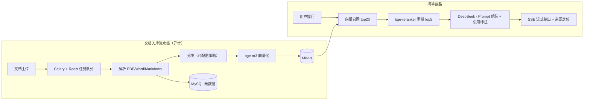

# KB-Copilot 企业级知识库问答平台

> 基于 FastAPI + 自研 RAG 链路的企业知识库问答平台：文档异步入库、两阶段检索（向量召回 + 重排序）、SSE 流式问答、引用溯源、Ragas 自动化评测闭环。

## 架构

*（架构图将随开发进度细化）*

## 技术栈

| 层 | 选型 |
|---|---|
| API | Python 3.11 · FastAPI · SSE 流式 |
| LLM | DeepSeek API（Qwen 对比） |
| Embedding / Rerank | bge-m3 · bge-reranker-v2-m3 |
| 向量库 | Milvus |
| 元数据 | MySQL 8 |
| 异步任务 | Celery + Redis（任务状态机：pending → parsing → embedding → done/failed） |
| 评测 | Ragas + 自建评测集（100+ QA） |
| 部署 | Docker Compose |

## Roadmap

- [x] M1：FastAPI 骨架 + SSE 流式多轮对话（会话管理、上下文裁剪）
- [x] M2：文档异步入库流水线（解析 → 分块 → 向量化，任务可查询/重试/取消）
- [x] M3：两阶段检索 + 引用溯源（文件名 + 页码定位）+ 无答案兜底
- [ ] M4：Ragas 评测闭环（分块策略 / rerank / top_k 三组对照实验）
- [ ] M5：Docker Compose 一键部署 + 线上 Demo + CI

## 评测报告

*（M4 完成后填入：faithfulness / answer_relevancy / context_recall / context_precision 对照实验表格与结论）*

## 快速开始

*（M5 完成后填入：docker compose up 一键启动指引）*

## 技术决策记录（ADR）

见 [docs/adr/](docs/adr/)。

## 开发日志

见 [docs/devlog.md](docs/devlog.md)。
